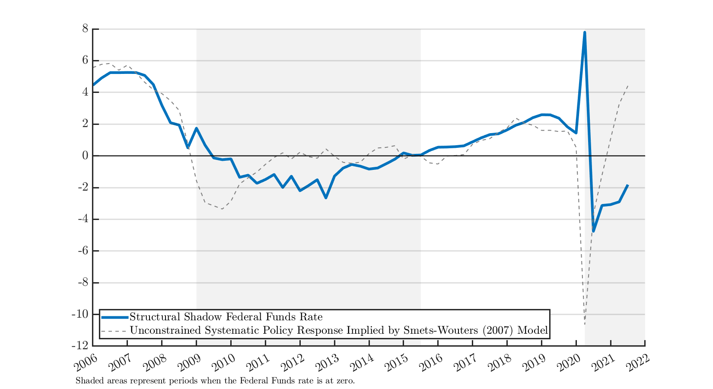
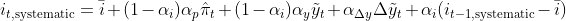

# Structural Shadow Federal Funds Rate

by Callum Jones, Mariano Kulish, and James Morley

The paper is available [here](https://www.federalreserve.gov/econres/feds/a-structural-measure-of-the-shadow-federal-funds-rate.htm).

## Structural Shadow Rate

Last updated on 04-November-2021. The latest observation is 2021:3.

### Data

The data is available in Excel format [here](https://github.com/callumjones/shadow-rate/blob/main/exhibits/shadowrate.xlsx?raw=true) and in a Matlab file [here](https://github.com/callumjones/shadow-rate/blob/main/exhibits/shadowrate.mat?raw=true).

The files contain the following variables.

| Variable | Description |
|----------| ----------- |
| `date`   | Quarters, starting from 1984Q1 |
| `fedfundsrate` | Federal Funds Rate, Annualized |
| `fedfundsrate_shadow` | Shadow Federal Funds Rate, Annualized |

## The Stance of Monetary Policy

The implied systematic policy response to economic conditions is based on the policy rule without monetary policy or shadow rate shocks but allowing for interest rate smoothing, i.e., 

 where the 's are the monetary policy response coefficients and  is the output gap from the flexible price equilibrium for the [Smets and Wouters (2007)](https://www.aeaweb.org/articles?id=10.1257/aer.97.3.586) model detailed in the appendix of [Jones, Kulish, and Morley (2021)](https://www.federalreserve.gov/econres/feds/a-structural-measure-of-the-shadow-federal-funds-rate.htm). The lines correspond to posterior means.

<!---
## Figure Reproduction

### Software Requirements

- The code is written in Matlab.
- The [Dynare](https://www.dynare.org/) package is used to run the model simulations. The scripts work with version 4.6.0 of Dynare.

### Figures

The figures in the paper are computed by running the scripts below. All figures are printed to the figures directory specified at the top of each script.

| Figure File Name         | Script to Run                       |
|--------------------------|-------------------------------------|
|shadow_rate_main_v2       | `run_shadow_distribution`           |
|shadow_rate_main_shocks   | `run_shadow_distribution`           |
|shadow_rate_zlb_combined  | `run_shadow_distribution`           |
|contribution_sh_shocks_srlr_sh_r20only | `run_long_rate_decomp` |
|stsr_var_zlb              | `run_var`                           |
|wuxia_var_zlb             | `run_var`                           |
|shadow_rate_main_ext_v2   | `run_shadow_distribution`           |
-->
