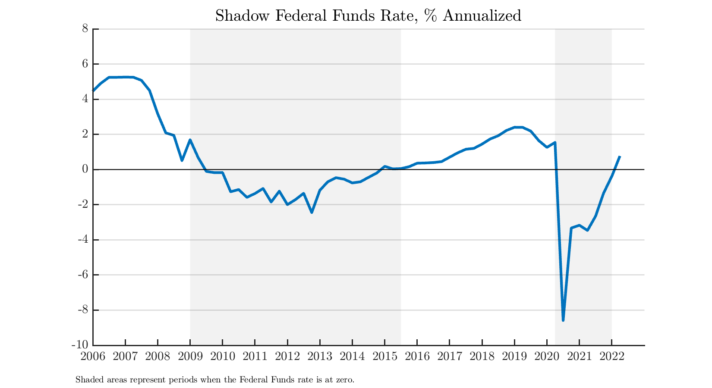

## Shadow Rate

"A Structural Measure of the Shadow Federal Funds Rates"

Callum Jones, Mariano Kulish, and James Morley

## Structural Shadow Rate

Updated on DATE_HERE.

## Data

The data is available in Excel format [here](exhibits/shadowrate.xlsx) and in a Matlab file [here](exhibits/shadowrate.mat). 

The Excel spreadsheet has the following information.
- shadowrate.xlsx: Excel worksheet with the date (in quarters, with name `date`) Federal Funds Rate (with name `fedfundsrate`) and the Structural Shadow Federal Funds Rate (with name `fedfundsrate_shadow`).

## Figures in the Text

`shadow_rate_main` - shocks_shadow_dist
`shadow_rate_main_shocks` - shocks_shadow_dist

`shadow_rate_zlb_combined` - shocks_shadow_dist

`contribution_sh_shocks_srlr_sh_r20only` - long_rate_decomp

`stsr_var_zlb` - run_var
`wuxia_var_zlb` - run_var

`shadow_rate_main_ext`